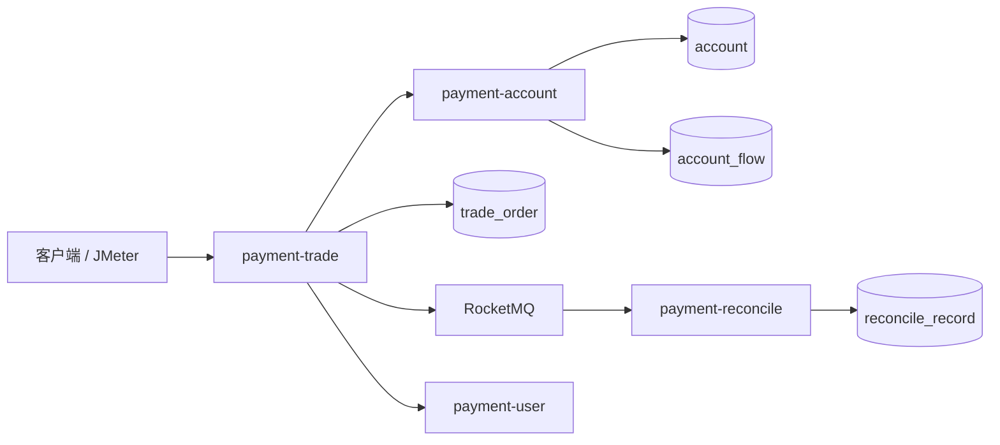
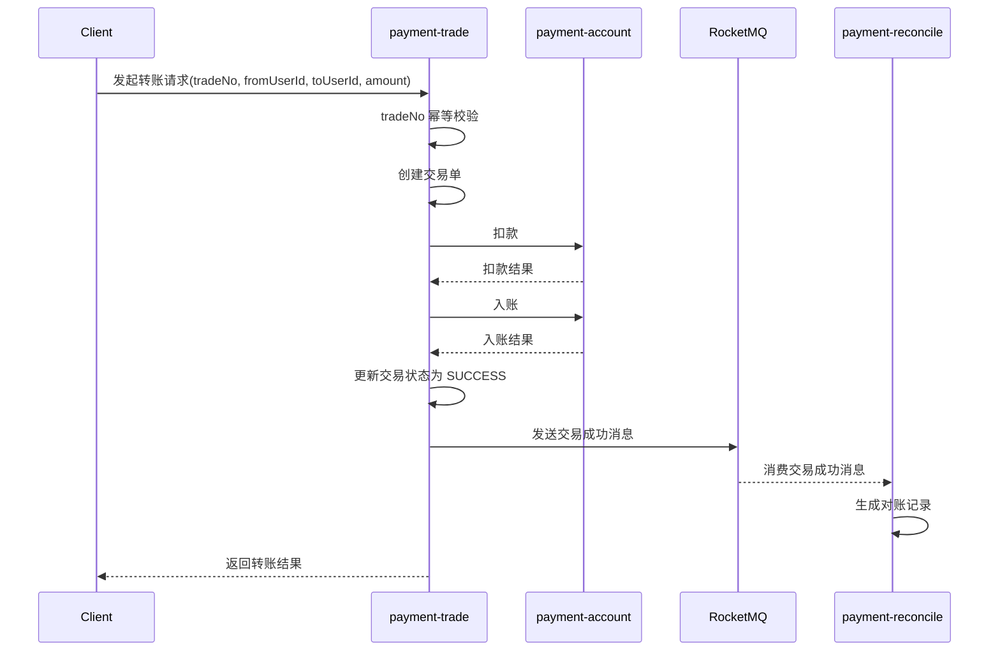

# payment-system

基于微服务的支付系统设计与实现。

## 1. 项目简介

本项目面向支付转账与对账场景，围绕 **账户、交易、对账、用户** 等核心能力拆分微服务，重点实现了：

- 转账主链路闭环
- 基于 `tradeNo` 的幂等控制
- 基于 RocketMQ 的异步对账
- 异常状态处理与补偿机制
- 本地依赖环境搭建与基础压测验证

项目目标不是简单完成接口开发，而是尽可能模拟真实支付系统中的关键问题，包括 **重复提交、异步解耦、最终一致性、异常补偿与基础性能验证**。

---

## 2. 技术栈

- Java
- Spring Boot
- MySQL
- Redis
- RocketMQ
- Maven
- Docker Compose
- JMeter

---

## 3. 项目架构

### 3.1 服务划分

- **payment-user**：用户基础信息服务
- **payment-account**：账户服务，负责余额管理、扣款、入账、流水记录
- **payment-trade**：交易服务，负责交易单创建、主链路编排、状态流转
- **payment-reconcile**：对账服务，负责消费交易成功消息并生成对账记录
- **payment-common**：公共模块，封装 DTO、统一返回体、通用工具类

### 3.2 架构示意



---

## 4. 核心业务流程

### 4.1 转账主流程

1. 客户端发起转账请求，携带 `tradeNo`
2. `payment-trade` 根据 `tradeNo` 查询交易单是否已存在
3. 若不存在，则创建交易单，初始状态为处理中
4. 调用 `payment-account` 完成付款方扣款
5. 调用 `payment-account` 完成收款方入账
6. 更新交易状态为成功
7. 发送交易成功消息到 RocketMQ
8. `payment-reconcile` 消费消息并生成对账记录

### 4.2 流程时序图



---

## 5. 核心设计点

### 5.1 幂等控制

转账请求以 `tradeNo` 作为幂等标识，交易服务在处理前先查询是否已存在相同交易单：

- 若已存在，则直接拦截，避免重复创建交易单
- 若不存在，则继续执行业务流程

该机制可有效避免重复提交导致的：

- 重复创建交易单
- 重复扣款
- 重复入账

### 5.2 异步解耦与最终一致性

交易成功后，`payment-trade` 不直接同步调用对账逻辑，而是通过 RocketMQ 投递交易成功事件，由 `payment-reconcile` 异步消费消息生成对账记录。

这样做的好处是：

- 降低主链路耦合
- 缩短主请求处理路径
- 便于后续对失败消息进行重试或补偿
- 更符合支付场景下“最终一致性”的处理思路

### 5.3 异常处理与补偿

针对支付业务中的异常场景，系统设计了失败状态留痕与补偿处理思路，覆盖如下场景：

- 余额不足
- 账户不存在
- 重复提交
- 异步对账异常
- 对账恢复重试
- 批量补偿
- 定时补偿

---

## 6. 模块说明

### 6.1 payment-user

负责用户基础信息管理，为账户与交易业务提供用户标识支撑。

### 6.2 payment-account

负责账户核心能力，包括：

- 账户查询
- 余额管理
- 扣款
- 入账
- 账户流水记录

### 6.3 payment-trade

负责交易主链路编排，包括：

- 交易单创建
- `tradeNo` 幂等校验
- 调用账户服务完成扣款/入账
- 更新交易状态
- 投递交易成功消息

### 6.4 payment-reconcile

负责消费交易成功消息并生成对账记录，同时承担异常对账处理与补偿能力。

### 6.5 payment-common

封装公共 DTO、统一返回结构、通用工具类等。

---

## 7. 数据表说明

项目当前核心表包括：

- `account`：账户表
- `account_flow`：账户流水表
- `trade_order`：交易单表
- `reconcile_record`：对账记录表

---

## 8. 本地运行方式

### 8.1 环境准备

建议环境：

- JDK 8 / 17
- Maven 3.8+
- Docker / Docker Compose
- MySQL
- Redis
- RocketMQ

### 8.2 启动依赖环境

通过 Docker Compose 启动本地依赖：

- MySQL
- Redis
- RocketMQ

### 8.3 启动服务

按需启动以下服务：

- `UserApplication`
- `AccountApplication`
- `TradeApplication`
- `ReconcileApplication`

### 8.4 基础验证

可通过 Postman、IDEA `.http` 文件或 JMeter 对转账接口进行验证。

示例请求：

```json
{
  "tradeNo": "CHECK_000001",
  "fromUserId": 1,
  "toUserId": 2,
  "amount": 1.00
}
```

---

## 9. 压测验证

项目使用 JMeter 对成功转账场景进行了分阶段压测，测试条件为：

- 请求场景：成功转账
- `fromUserId = 1`
- `toUserId = 2`
- `amount = 1.00`
- 每条请求使用唯一 `tradeNo`

### 9.1 压测结果

| 轮次 | 线程数 | Ramp-Up(s) | Loop Count | 总请求数 | Error % | Average(ms) | Min(ms) | Max(ms) | Throughput(req/s) |
|---|---:|---:|---:|---:|---:|---:|---:|---:|---:|
| 第1轮 | 5 | 5 | 2 | 10 | 0.00% | 170 | 37 | 1068 | 2.4 |
| 第2轮 | 10 | 5 | 5 | 50 | 0.00% | 43 | 21 | 182 | 10.6 |
| 第3轮 | 20 | 10 | 5 | 100 | 0.00% | 34 | 18 | 137 | 10.3 |
| 第4轮 | 50 | 10 | 4 | 200 | 0.00% | 29 | 18 | 132 | 20.2 |

### 9.2 压测结论

在当前本地环境下，系统在成功转账场景中完成了 10、50、100、200 次请求的分阶段验证，错误率均为 **0%**。  
在 200 次请求规模下，系统平均响应时间为 **29 ms**，最大响应时间为 **132 ms**，吞吐量达到 **20.2 req/s**。  
同时结合数据库账户余额变化可验证，付款方与收款方金额变化与请求总量完全一致，说明系统不仅接口返回成功，而且真实完成了资金流转与状态更新。

---

## 10. 项目亮点

- 面向支付场景拆分账户、交易、对账、用户等微服务模块
- 实现转账主链路闭环，完成交易创建、扣款、入账、状态更新
- 基于 `tradeNo` 实现幂等控制，降低重复提交风险
- 基于 RocketMQ 实现交易成功事件异步投递与对账处理
- 设计异常状态留痕与补偿恢复机制
- 通过 JMeter 完成基础压测验证，并结合数据库结果核对业务真实性

---

## 11. 当前不足与后续优化方向

后续计划继续完善以下方向：

- 更细粒度的统一异常处理与返回码规范化
- 补充链路日志与监控能力
- 增加更高并发规模下的性能测试
- 完善更多异常场景测试用例
- 优化对账补偿任务的自动化程度

---

## 12. 项目地址

[BrotherStone302/payment-system](https://github.com/BrotherStone302/payment-system)